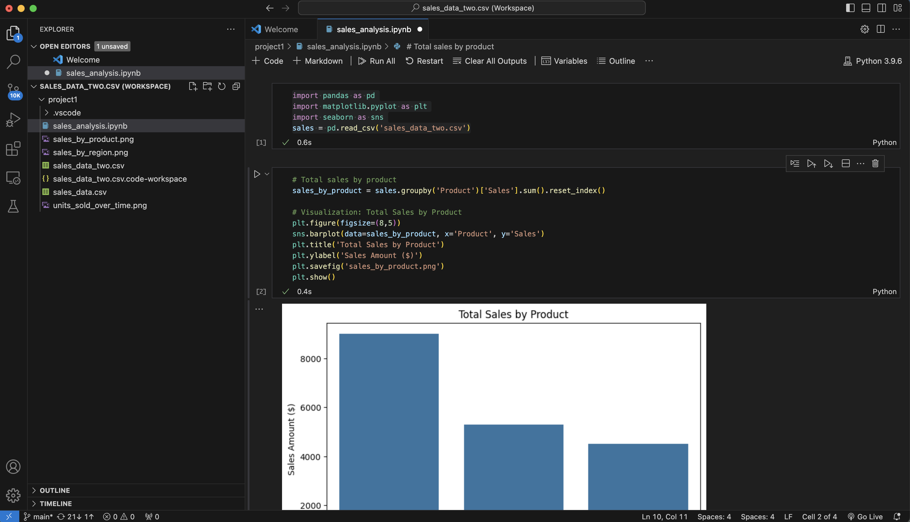
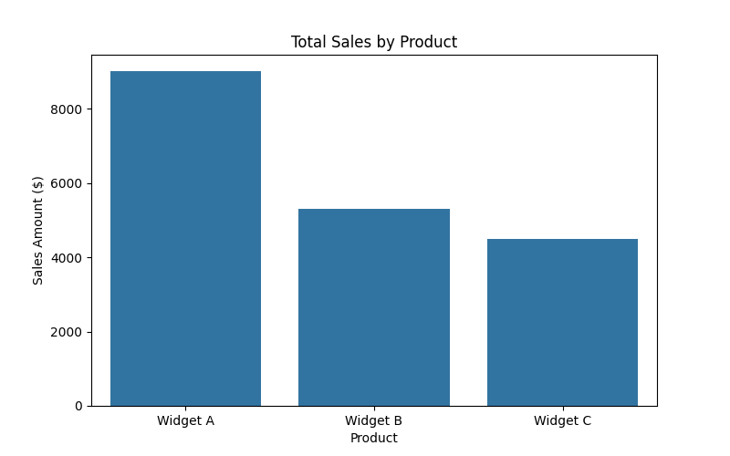
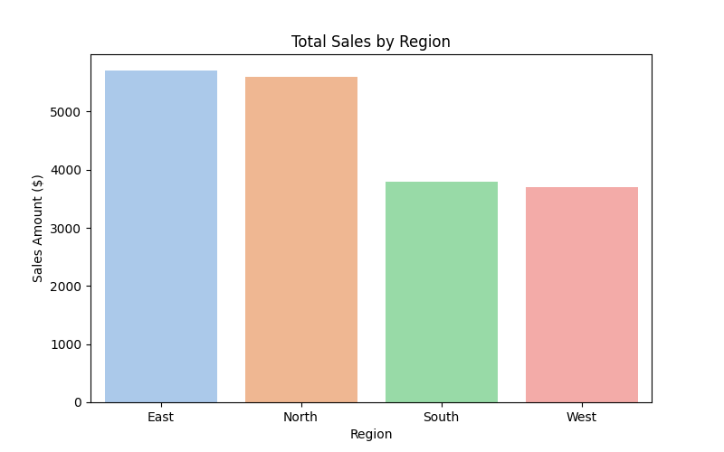
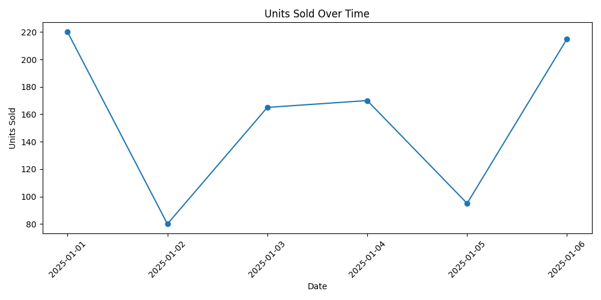

### Sales Performance Analysis
**Short Description:** Analyze sales data to uncover trends, compare product and regional performance, and visualize key metrics to support strategic decision-making.

**Overview:**  
This project demonstrates the ability to analyze sales datasets using Python, Matplotlib, and Seaborn. Key analyses include total sales by product and region, units sold over time, and insights into business performance.

**Skills Highlighted:**  
- Data cleaning and summary statistics  
- KPI analysis and insights generation  
- Data visualization (Matplotlib, Seaborn)  
- Excel and Python integration

## 📊 Code Preview

  
## 📊 Visualizations

